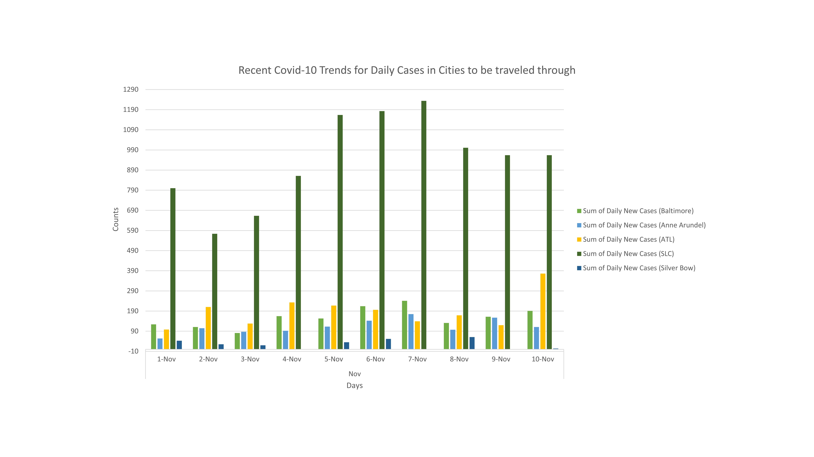

# Baltimore-Butte-comparing-covid-19-data using county level data from New York Times Covid-19 Data - US Counties and States 
Comparing Covid-19 data in Baltimore, MD and Butte, MT from year 2020
## __Isaac Johnson__ 
### __Mini Project #1 - Data Trends and Visualization with Excel__
### Decision Analytics
### EN.663.667 (02)
### 2020.11.14

# Background
Covid-19 virus likely originated from China in 2019. From there it spread around the world and infected many people. The US in particular has experienced bad outbreak due to variety of reasons e.g. lax travel restrictions in the early months of the pandemic, lack of monitoring for symptoms of incoming people, lack of testing or PPE production during the early deays of the pandemic, and lack of coordinated federal response bu US govt towards Covid-19. Additionally, mixed messaging and politicization of practical safety measures exacerbated the spread of the virus, as well as peoples general indifference toward something not directly impacting them. Since Covid-19 has continued to spread throughout the USA and we've recently begun breaking new daily case records its possible many companies or local governments are looking at strongly suggesting or limiting travel during the upcoming winter holidays e.g. Thanksgiving and Christmas/New Years. Therfore it's prudent to familiarize oneself with the metrics used to assess Covid-19 spread and what current guidelines are for travel, testing, quarantining etc. 

# Business Question
__How can a manager or HR personnel decide whether to approve an employees travel request plan based on submitted flight data or travel itinerary and what benchmarks should they consider when deciding?__

# Data Question - Open Data
Data may come from the below sources:
1. __New York Times Covid-19 Data - US Counties and States__: The New York Times provides Covid-19 data, both live and historical, for the Covid-19 epidemic occuring within the USA + territories during year 2020. Data is available on national, state and county level and available data has been tracked since the epidemic started in January. This data comes from reports from state and local health agencies. Due to shortages of tests that were available the data may not reflect full extent of epidemic.
  i. The data used will be historical data. This data does not include results from current day but does include results up to current day. There will be no distinction made between probable cases and/or lab confirmed cases. 
2. __Press releases from state and local authorities__: These posts will be sourced from government websites or local websites where the executive orders or briefings are made available. The City of Baltimore Executive orders can be found [here](https://www.baltimorecity.gov/executive-orders), Maryland state press briefings can be found [here](https://governor.maryland.gov/coronavirus/), updates on status of reopening in Montana can be found [here](https://covid19.mt.gov/joint-information-center), and information on Butte, MT can be found at county level by looking at Silverbow county data [here](https://www.co.silverbow.mt.us/2167/COVID-19).
3. __Technical Definitions__:The data is organized geographically by Federal Information Processing Standards [FIPS](https://www.census.gov/library/reference/code-lists/ansi/ansi-codes-for-states.html) State Numeric Codes. In this case we are concerned with Maryland (FIPS - 24) and Montana (FIPS - 30). [County level](https://www.nrcs.usda.gov/wps/portal/nrcs/detail/national/home/?cid=nrcs143_013697) FIPS data is available here. This allows the analyst to look at specific regions of travel e.g. Baltimore City (considered county equivalent), Silverbow County (Butte, MT and Bert Mooney airport (BTM)), Anne Arundel County (Baltimore/Washington International Thurgood Marshall (BWI) airport), as well as the airport layovers for example Salt Lake City airport (SLC, Salt Lake County) and Atlanta airport in GA.
4. The original files can be accessed on google drive [here](https://drive.google.com/drive/folders/1yKs4EpQ-lBj622hN-uQh5lPIDsdcVdiz?usp=sharing), and the edited files can be found [here](https://drive.google.com/drive/folders/1LyowVM_9O5uZdNPDw40N82UA0UU1BN_G?usp=sharing). Links are open access. 

# Data Question - Analysis
Microsoft Excel will be used for data analysis
- __What has the previous month's trend been in terms of covid cases?__ This will look at daily cases at city and county level to see whether the region is entering danger zone and look at [incidence](https://www.cdc.gov/coronavirus/2019-ncov/downloads/global-covid-19/SARS-CoV-2-Transmission-Metrics.pdf) defined as "the occurence of new cases of a disease over a specified period of time" and mathematically defined as ((number of new cases of disease during specified period)/(by size of population at start of period)) * 100,000 gives you cases per 100,000 population. By using incidence can compare different regions. The population size is based on census data last taken in 2010 found here for [SilverBow county](https://www.census.gov/prod/cen2010/cph-2-28.pdf), [Baltimore City/Anne Arundel County](https://www.census.gov/prod/cen2010/cph-2-22.pdf), [Georgia](https://www2.census.gov/library/publications/decennial/2010/cph-2/cph-2-12.pdf), and [Utah](https://www.census.gov/prod/cen2010/cph-2-46.pdf). The data from NYT is reported in terms of __cumulative__ cases so daily difference must be taken to get daily new cases. Sometimes a person is later reclassified to different county, state etc so this explains a decrease in cumulative cases over time that may occur throughout data. An alternative is to consider [incidence rate](https://www.cdc.gov/csels/dsepd/ss1978/lesson3/section2.html) but that assumes that probability of disease is constant. Given the flux of people through all areas of USA this doesn't seem like a valid metric to use as risk increases with higher population densities and other factors e.g. age, state of immune system etc.
- __What is the previous month's trend for deaths or fatality rate and ICU capacity?__ This will look at daily reported deaths and percentage of ICU beds at state or county level (as available) to provide idea about whether state/county health agencies are in danger of being overwhelemed.The Department of Health and Human Services (HHS) provides state level data on this [here](https://healthdata.gov/dataset/covid-19-estimated-patient-impact-and-hospital-capacity-state). 
- __What have been the previous month's recommendations from Governor or Mayor?__ This will provide an idea of how proactive government agencies are being at handling pandemic and allow for travel/post travel plans to be made so that the spread of Covid-19 can be limited and travel can be conducted safely or with minimized risk.

# Data Answer
## Trends in daily covid cases
First we looked at daily covid cases, for the past ten days, for each of the cities being traveled through. This provides some surveillance of the landscape we're going to potentially be interacting with. Baltimore City, Fulton County, and Salt Lake County are mid size cities with populations ranging between 500k - 1.2 million. Silverbow county on the other hand is quite small with less than 35k people. The general trend appears to be that daily cases are rising or plateauing at relatively high levels. This suggests the region is in the midst of an active covid surge. But these are just daily cases its difficult to say based on this alone.

Secondly, we examined 3-day averaged incidence and 7 day averaged incidence for Baltimore City and Silver Bow county. According to the CDC, the 3-day incidence number can be used to determine whether illnesses in the area are increasing, decreasing, or stable. The 7-day incidence is a common metric included in county and state level data so we included that too. Often there tends to be decreases in testing over the weekend so this helps smooth that out. As noted below many states have requirements regarding testing, or travel adviseries etc., if the 7 day average of cases per 100k is over a certain threshold. Furthermore, depending on the level its possible to know the threat level of the region with [classifications](https://ethics.harvard.edu/files/center-for-ethics/files/key_metrics_and_indicators_v4.pdf) as follows: green (< 1 daily new case per 100k), yellow (< 10 daily new case per 100k), orange (10<25 daily new case per 100k), and red (> 25 daily new case per 100k). As one can see average cases per 100 k have risen significantly in both locations over the course of the last month. While Baltimore has experienced more a rising plateau, the outbreak in Silver Bow county is much more severe and illnesses are increasing rapidly. 

## Trends in daily deaths
The daily death rate for Baltimore City and Silver Bow county are shown below in FIgure 4. During the month of October and throughout November the death rate was stable in Baltimore city. In Silver Bow county there were essentially no deaths throughout October. However, as incidence began rising in October, this has lead to the death rate creeping up during the beginning of November. Given that cases per 100k are still rising there the death rate is expected to rise further. Additionally, Montana is a sparsely populated state. It does not have comparable resources to Maryland. Standards of care are likely to fall as cases rise, leading to more deaths, and the hospital bed ICU system has a much lower capacity compared to Maryland.

## Occupancy of Beds in Hospitals for Maryland and Montana
Here we can see recent trends in hospitalizations for these two states. In terms of total beds occupied the ratios have remained relatively constant over the past month with Montana percentage about 60-70% while Maryland is steady 80%. While Maryland does have a higher occupancy rate than Montana, it could be do to variety of reasons e.g. more elective procedures. Both states also have high percentage of ICU beds currently occupied however Montana hospitals seem to have seen an increase of about 10-15% over the past month. This could be partly attributed to rise in Covid-19 cases or perhaps weather related incidents as the temperatures have fallen there recently. Lastly, we look at occupancy of ICU beds as percentage of Covid-19 afflicted patients. Both currently have relatively low percentage of beds occupied by covid-19 patients, however these patients typically require significant amounts of care and occupy the ICU beds for longer times than traditional ICU patients. Both states have seen a rise of about 4-5% in Covid-19 bed usage over the past month. Care should be taken to reduce the rising number of cases incoming lest the hospital system be overwhelmed. While remaining hospital beds can be converted to ICU beds there are staff concerns and potentially eventually space concerns. Additionally, as the US experiences widespread outbreaks throughout the nation, rather than the regional ones previously seen, it becomes much more difficult to send workers to places that need surge capacity.      

## Airport Safety Precautions
1. Currently BWI airport has a number of administrative controls in [place](https://www.bwiairport.com/COVID19socialdistancing) to minimize spread of Covid-19. These include all restuarants at 50% capacity, social distancing and masks required, as well as various plexiglass installments at high traffic areas (e.g. security, airline counters, checkout lines etc.). Currently the government of the state of Maryland, and posted on the BWI [airport](https://www.bwiairport.com/COVID19socialdistancing) strongly discourages travel to areas with incidence equal to or greater than 20 per 100k. 
2. The [ATL](https://www.atl.com/COVID19/) airport seems to have less restrictions in place. Face masks, signage and increased cleaning are part of their mitigation efforts however there was no mention of plexiglass controls or reduced restaurant capacity.\
3. [SLC](https://slcairport.com/customer-assistance/travel-advisory-2/) had similar restrictions as BWI and mentioned use of touchless restroom controls. 
4. [BTM](https://co.silverbow.mt.us/2167/COVID-19) listed basic conditions such as mask wearing and hygiene but no other engineering controls were mentioned. They did include latest update on local Covid-19 status, local restrictions in place and most recent state goal i.e. getting 7 day incidence below 25 per 100k for two weeks.
The [Maryland Department of Health](https://phpa.health.maryland.gov/Documents/2020.11.10.03_MDH_Advisory_Large_Gatherings_Travel_Long_Term_Care_Visitation.pdf) recently issued guidance for travelers from Maryland. They recommended all Maryland residents returning from out of state get tested for Covid-19 within 72 hours of their departure from their out of state destination. Furthermore it is recommended they quarantine while awaiting their test results. Secondly, any Marylander who travels to state with Covid-19 rate greater than or equal to 20 per 100k (in past 7 days of their visit) should be tested and quaratine at home until results have been received.  
# Business Answer
Using this data analysis the company personnel can examine regional trends regarding Covid-19 outbreak and assess the level of risk that the employee may be subjecting themselves to during their travel. The manager should be aware this data analysis may not indicate emerging outbreaks as these tend to flare up suddenly. Furthermore this assessment does not make any assumptions regarding employee behavior during travel, which will likely be the largest factor that will impact Covid-19 risk. It's recommended that travel be approved or rejected based on trends and local guidance and then reassessed within one week of departure date to see how the outbreak has evolved and plans adjusted accordingly. Organizational guidance regarding holiday travel can be found [here](https://hub.jhu.edu/2020/10/20/covid-19-winter-holidays/?mc_cid=295c6bc1e2&mc_eid=4aff72f931). Based on available data presented above travel is strongly discouraged to Silver Bow county as Covid-19 incidence is in red zone for both departure and arrival cities, and hospital capacity appears limited in both states. Should travel occur the indivual should test before leaving and after arrival to destination, as well as upon return. The individual should quarantine at residence until results of testing are known.  
